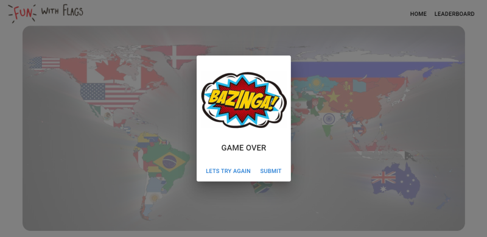
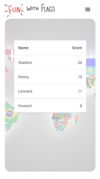

# Fun with flags - fun flag quiz game
Deployed on Netlify : 
https://fun-with-flags.netlify.app/
## Description
How well do you know the flags of the world?
Test your knowledge with this fun game inspired by "The Big Bang Theory "
## Technologies used

Created with create-react-app and used the following libraries

- React (17.0.2)
- React-router-dom
- Material-ui

## Usage

To run this project locally

### `npm install`

Installs dependencies

### `npm run start`

Runs the app on the local server. 
Opens http://localhost:3000

## Screenshots

Web

  
      
      
      
      

Mobile

  
      
      
      
      

